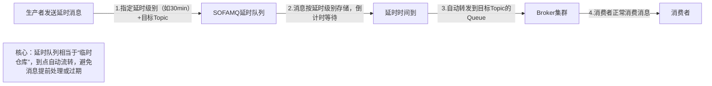
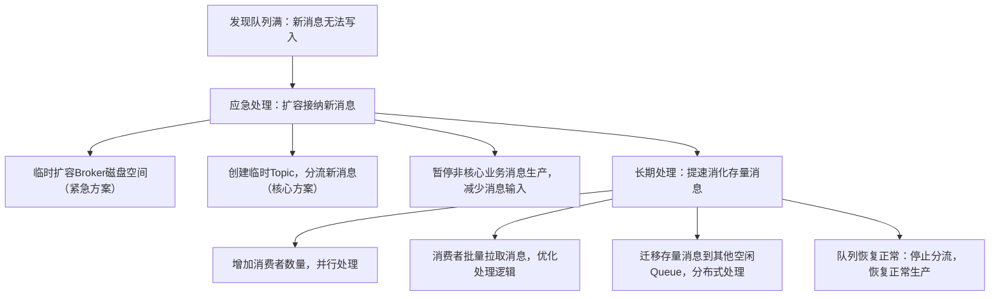
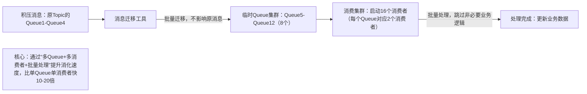

# SOFAMQ核心问题解决：延时/过期+队列满+百万消息积压（通俗讲解+表格+图文）

先统一“快递配送”类比框架，帮你快速代入：

- SOFAMQ = 快递配送系统（负责消息/快递的存储、流转）；

- 消息 = 快递（有送达时效，超期可能失效）；

- Broker/Queue = 快递中转站/分拣传送带（有存储容量上限）；

- Producer = 寄件人（发消息/寄快递）；

- Consumer = 收件人/配送员（处理消息/送快递）；

- 延时消息 = 预约配送的快递（指定时间后再送达）；

- 消息过期 = 快递超期未取（被退回或丢弃）；

- 队列满/消息积压 = 中转站快递堆成山，配送员忙不过来。

核心原则：SOFAMQ的这类问题，本质是“消息生产速度＞处理速度”“存储/时效配置不合理”，解决思路围绕“控生产、提处理、调配置、扩容量”展开。

## 一、问题1：如何解决消息延时/过期失效问题？

消息延时：消息发出去后，过了很久才被消费者收到；
消息过期失效：消息超过设定的存活时间（TTL），被SOFAMQ自动丢弃，导致消费者无法处理。

### 1. 先搞懂：为什么会延时/过期？（表格总结）

|问题类型|通俗原因（快递类比）|SOFAMQ场景具体说明|
|---|---|---|
|消息延时|配送员太少/配送路线远/中转站堆积，快递送慢了|① 消费者数量不足，处理速度赶不上生产速度；② 消息路由路径长（跨Broker集群）；③ 网络波动/ Broker负载过高；④ 消息被设置了延时投递（业务需求）|
|消息过期失效|快递标注“3天内取”，超期后被快递站丢弃|① 消息设置了TTL（存活时间），堆积后超期；② 死信队列消息超期未处理；③ 业务配置的TTL过短，不匹配实际处理耗时|
### 2. SOFAMQ解决方案（通俗版+图文）

|解决场景|核心方案|通俗拆解（快递类比）|SOFAMQ具体操作|适用场景|
|---|---|---|---|---|
|业务允许的延时（非故障）|使用SOFAMQ延时队列|寄件时指定“3天后配送”，快递站专门存放这类快递，到点再配送|① 创建延时Topic，指定延时级别（如10s、1min、1h等）；② 生产者发送消息时，指定消息的延时级别；③ 消息会先存放在延时队列，到点后自动转入目标Topic，被消费者处理|预约通知、定时任务（如订单30分钟未支付自动取消）|
|故障性延时（需提速）|提升消费者处理能力|快递堆积后，加派配送员、优化配送路线，提高配送效率|① 增加同一消费组的消费者数量（最多等于Queue数量）；② 优化消费者业务逻辑（如异步处理、批量处理）；③ 避免消费者处理耗时过长（设置合理的处理超时时间）|突发流量导致的消息堆积延时|
|消息过期失效预防|合理配置TTL+过期消息入死信队列|① 快递标注更长的取件时间；② 超期快递不丢弃，单独存放等待处理|① 调整消息TTL配置（核心业务消息可设置较长TTL，或不设置TTL）；② 开启死信队列，过期消息自动转入死信队列，不直接丢弃；③ 定期监控死信队列，人工处理过期消息|核心业务消息（如订单、支付消息），不允许丢失|
|降低网络/ Broker延时|优化集群部署+网络配置|① 中转站建在收件人附近；② 优化中转站内部分拣流程|① Broker集群部署在业务服务器同地域，减少跨地域网络延迟；② 避免单Broker负载过高，均衡Topic的Queue分布；③ 优化网络带宽，避免网络拥堵|对延时敏感的业务（如实时通知）|
### 3. 延时队列核心流程（图文）

## 二、问题2：消息队列满了以后该怎么处理？

SOFAMQ的Queue有存储容量上限（如磁盘空间限制），队列满后，新消息会无法写入，导致生产者发送失败。

### 1. 核心解决思路：先“应急扩容”接纳新消息，再“提速处理”消化存量

### 2. 具体方案拆解（表格）

|处理阶段|方案|通俗拆解（快递类比）|SOFAMQ具体操作|注意事项|
|---|---|---|---|---|
|应急阶段（优先保证新消息能写入）|临时分流新消息|中转站满了，临时开辟新的仓库存放新快递，避免快递员无法寄件|① 创建临时Topic（如topic_temp），将新消息的生产地址切换到该Topic；② 给临时Topic配置多个Queue，分散存储压力；③ 待原队列消化完后，再将临时Topic的消息迁移回原Topic（可选）|需提前做好消息生产地址的动态切换配置，避免业务中断|
|应急阶段|扩容Broker存储|给中转站紧急扩建仓库，增加存储容量|① 检查Broker节点的磁盘使用情况，清理无用日志/文件，释放空间；② 临时挂载云磁盘，扩容Broker的存储容量（适合云部署场景）|仅为临时方案，长期需优化消息处理效率，避免再次满队列|
|消化阶段（处理存量消息）|分布式并行处理|加派大量配送员，分区域并行配送堆积的快递|① 增加消费组的消费者数量（最多等于Queue数量，若Queue不足可临时增加Queue）；② 将原队列的存量消息迁移到多个空闲Queue，由不同消费者并行处理；③ 开启消费者批量拉取模式（如一次拉取10条消息），减少网络交互耗时|增加消费者时，需确保消费组内的消费者分工明确，避免重复消费|
|预防阶段（避免再次满队列）|配置队列满保护+监控预警|① 给中转站设置“满仓预警”，快满时提醒；② 满仓后拒绝非核心快递，优先保障核心快递|① 配置SOFAMQ的队列满保护策略（如拒绝非核心Topic的消息、降级处理）；② 监控Broker磁盘使用率、Queue消息堆积数，设置阈值预警（如堆积超过1万条报警）；③ 核心业务Topic预留足够的存储和Queue资源|预警阈值需根据业务峰值合理设置，避免误报警或漏报警|
## 三、问题3：几百万消息持续积压几小时，怎么解决？

这类问题属于“严重消息堆积”，核心风险是“消息过期失效”“业务中断”，解决思路是“**先保核心业务，再快速消化积压，最后优化预防**”，分3步走。

### 1. 第一步：应急止血（0-30分钟，优先保证核心业务不中断）

核心目标：不让新消息继续堆积，确保核心业务的消息能正常处理。

1. **分流新消息**：创建多个临时Topic（如topic_backlog_1、topic_backlog_2），将非核心业务的消息生产暂时切换到这些临时Topic；核心业务的消息继续走原Topic，但临时增加原Topic的Queue数量（如从4个增加到8个），分散存储压力。

2. **暂停非核心消费**：暂时停止非核心业务消费组的消费，把资源让给核心业务的消费者；核心业务的消费者数量拉满（等于Queue数量），确保核心消息能快速处理。

3. **延长消息TTL**：将原Topic和临时Topic的消息TTL延长（如设置为24小时），避免积压消息在消化完成前过期失效；同时开启死信队列，防止个别消息遗漏。

### 2. 第二步：快速消化积压消息（30分钟-几小时，核心步骤）

核心目标：用“分布式并行处理”的方式，快速清空积压的几百万消息。

1. **消息迁移**：使用SOFAMQ的消息迁移工具，将原Topic积压的消息批量迁移到多个临时Queue（如8个Queue），实现消息的分布式存储。

2. **扩容消费能力**：启动大量消费者（如16个），分成多个消费组，每个消费组对应不同的临时Queue；消费者开启“批量拉取+异步处理”模式（如一次拉取50条消息，异步写入数据库/缓存），跳过非必要的业务逻辑（如日志打印、非核心校验），只保留核心处理步骤。

3. **监控进度**：实时监控每个Queue的消息堆积数、消费者处理速度，确保没有消费者闲置或处理失败；若某条消息处理失败，暂时跳过（转入死信队列），优先处理其他消息，避免个别坏消息阻塞整个队列。

### 3. 第三步：后续优化（消化完成后，避免再次发生）

核心目标：从“生产、消费、集群配置”三个维度优化，根除消息堆积隐患。

|优化维度|具体措施|通俗拆解（快递类比）|
|---|---|---|
|生产端优化|① 核心业务消息限流：峰值时限制非核心业务的消息生产速度；② 消息批量发送：生产者开启批量发送模式，减少消息发送次数；③ 生产失败重试策略：避免无效重试导致消息重复生产|① 高峰期限制非核心快递寄件；② 快递员批量取件，减少往返次数；③ 寄件失败后不盲目重试，避免重复寄件|
|消费端优化|① 弹性扩容：基于消息堆积数自动扩缩容消费者数量（如云原生场景的K8s自动伸缩）；② 处理逻辑优化：异步化、批量化处理，移除冗余逻辑；③ 失败隔离：单个消息处理失败不影响整体消费，转入死信队列单独处理|① 快递堆积时自动加派配送员，空闲时减少配送员；② 配送员批量配送，优化路线；③ 疑难快递单独处理，不影响正常配送|
|集群配置优化|① 合理配置Queue数量：根据业务峰值设置足够的Queue，支持并行消费；② Broker集群扩容：增加Broker节点数量，均衡存储和负载压力；③ 完善监控预警：设置堆积数、磁盘使用率、处理耗时等多维度预警|① 中转站增加足够的分拣传送带；② 扩建中转站，增加存储和分拣能力；③ 安装满仓预警、超时预警设备|
## 四、总结：三大问题的核心解决逻辑

1.  消息延时/过期：核心是“**合理配置时效+提升处理速度**”，用延时队列满足业务延时需求，用死信队列避免过期丢失；
2.  队列满：核心是“**应急扩容接纳新消息+提速消化存量**”，配合监控预警预防再次发生；
3.  百万消息积压：核心是“**先止血保核心，再分布式快速消化，最后全链路优化**”，避免业务中断和消息失效。

一句话记住：SOFAMQ的消息问题，本质是“供需失衡”（生产＞消费）或“配置不当”，解决思路永远是“**控供给、提需求、调配置、扩容量**”。
> （注：文档部分内容可能由 AI 生成）