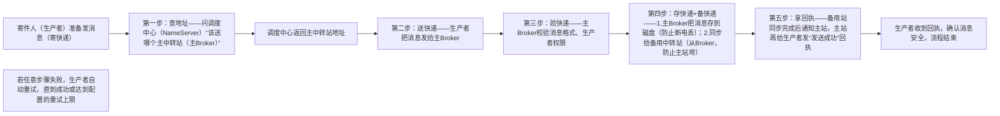

# SOFAMQ消息可靠发送流程（通俗讲解）

先明确核心目标：消息可靠发送，本质就是**让生产者发出去的消息，100%能被SOFAMQ妥善保管，就算遇到服务器故障、网络波动也不会丢**。

延续之前的“快递网络”类比，快速对应角色：

- 生产者 = 寄件人（要寄快递，担心快递丢）；

- NameServer = 快递调度中心（帮寄件人找正确的中转站地址）；

- 主Broker = 快递主中转站（核心收件、存件节点）；

- 从Broker = 备用中转站（实时备份主站的快递，防止主站出问题）；

- 消息 = 快递（要安全送到中转站并妥善保管）。

核心逻辑：可靠发送的关键是“**找对地址→确认接收→双重备份→收到回执**”，全程自动化，寄件人（生产者）不用额外操心。

## 一、可靠发送全流程（5步走，一步都不能少）

## 二、逐步拆解（通俗大白话）

1. **第一步：先找对“中转站”，别送错地方**
生产者不知道该把消息发给哪个Broker，就像寄件人不知道最近的中转站在哪，所以先主动问NameServer（调度中心）。NameServer会根据消息的“Topic”（相当于快递的“目的地片区”，比如“北京朝阳区快递”），精准返回对应的主Broker地址——确保消息能准确送到核心中转站，不会送错或送丢在半路。

2. **第二步：把“快递”交给主中转站**
生产者拿到地址后，就把消息直接发给主Broker。这一步就像寄件人把快递送到指定的主中转站窗口，完成“交件”动作。

3. **第三步：中转站先“验快递”，不合格直接退回**
主Broker收到消息后，不会直接收下来，会先做“安检”：检查消息格式对不对（比如有没有缺关键信息）、生产者有没有发送权限（比如是不是合法的寄件人）。如果校验不通过，会直接返回“发送失败”，生产者可以修正消息后重新发送。

4. **第四步：双重备份，确保“快递”不会丢**
这是最关键的一步！主Broker确认消息合格后，会做两件事保障安全：
① 把消息写入本地磁盘文件（专业叫“持久化”）——就像中转站把快递放进带锁的仓库，就算服务器突然断电、进程崩溃，重启后也能从磁盘里找回消息；
② 实时把消息同步给从Broker（备用中转站）——就像把快递复制一份存到备用仓库，就算主中转站突然垮了，备用站还有完整的消息备份，不会让消息跟着主站一起丢。

5. **第五步：拿到“安全回执”，才算真成功**
只有等从Broker完全同步完消息、并向主Broker返回“备份成功”的通知后，主Broker才会给生产者发“发送成功”的回执。生产者拿到这个回执，才能彻底放心——这说明消息不仅被主站接收，还做了双重备份，就算后续出现故障，消息也不会丢。

## 三、关键保障：失败了怎么办？

如果过程中出现网络抖动、主Broker暂时繁忙等问题，生产者没收到“发送成功”回执，不会就这么算了：

- **自动重试机制**：生产者会按照提前配置的规则（比如重试3次，每次间隔1秒）自动重新发送消息，避免因临时问题导致消息丢失；

- **重试上限处理**：如果达到重试上限还是失败，会记录日志并报警，提醒运维人员排查问题（比如主Broker真的宕机了，需要等故障切换完成）。

## 四、总结：可靠发送的核心就是“闭环保障”

SOFAMQ之所以能保证消息可靠发送，不是靠某一步，而是靠“**地址精准定位+消息校验+磁盘持久化+从站备份+成功回执+自动重试**”的全链路闭环：

- 从“找地址”到“拿回执”，每一步都有保障，不让消息在任何环节掉链子；

- 双重备份（磁盘+从站）解决了“单点故障丢消息”的问题；

- 成功回执+自动重试解决了“临时问题导致发送失败”的问题。

简单说：只要生产者收到了“发送成功”的回执，就可以100%确定消息已经安全存入SOFAMQ，后续就算出现故障，也能通过备份恢复，不会丢失。
> （注：文档部分内容可能由 AI 生成）