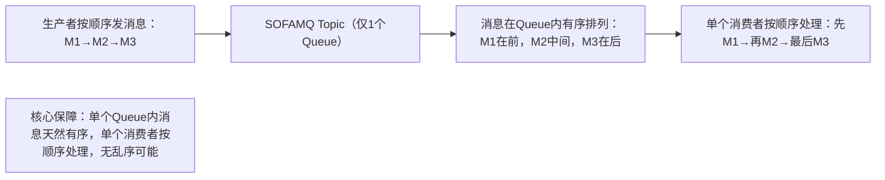
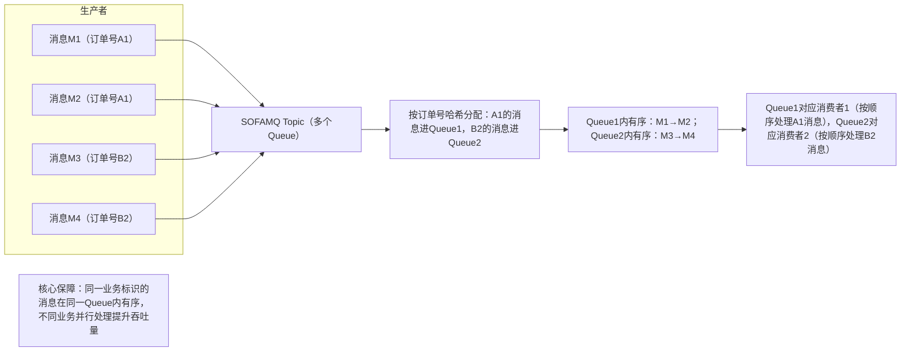
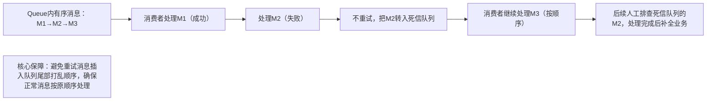

# SOFAMQ消息顺序性保障：通俗讲解+表格+图文

先搞懂核心概念：消息顺序性，就是生产者发送消息的顺序，和消费者接收、处理消息的顺序一致。比如你按“下单→支付→发货”的顺序发消息，消费者必须按同样顺序处理，不能出现“支付没处理就发货”的混乱。

用“排队买票”类比理解：

- 生产者 = 排队买票的人，按顺序提交“买票申请”（消息）；

- SOFAMQ的Topic/Queue = 售票窗口前的队伍，消息必须在队伍里按顺序排队；

- 消费者 = 售票员，必须按队伍顺序依次处理“买票申请”，不能跳号。

核心前提：SOFAMQ本身能保证“单个队列（Queue）内的消息有序”，但多个队列并行时，顺序会被打乱——就像多个售票窗口同时售票，每个窗口内的人按顺序来，但不同窗口的人之间没有统一顺序。

## 一、先搞懂：为什么消息顺序会乱？（3个常见原因）

|乱序原因|通俗类比（排队买票）|SOFAMQ场景具体说明|
|---|---|---|
|多队列并行|一个队伍拆成多个窗口，A在1号窗口排第1位，B在2号窗口排第1位，A和B的处理顺序不确定|SOFAMQ的一个Topic默认包含多个Queue（分区），生产者发消息时会均匀分配到不同Queue，不同Queue的消息并行处理，顺序自然打乱|
|消息重试/重发|A买票时证件不全被退回，重新排队后站到了B后面，原本A在B前面的顺序变了|某条消息处理失败后，SOFAMQ会重新发送该消息，重发的消息会排在新消息后面，导致原本的顺序错乱|
|多消费者并发处理|一个队伍安排多个售票员同时处理，有人抢着处理后面的人，导致顺序乱了|一个Queue对应多个消费者并发消费，不同消费者处理消息的速度不同，先发送的消息可能被后处理|
## 二、SOFAMQ保证消息顺序性的3个核心方案（通俗版）

### 方案1：单Queue部署（最基础、最稳妥）

核心逻辑：把Topic的Queue数量设为1，让所有消息都在同一个Queue里排队，相当于“只开一个售票窗口，所有人都按顺序排队”。

通俗拆解：

1. 生产者发送的所有消息，都进入同一个Queue，SOFAMQ会按接收顺序把消息存成“队列”（先进先出，FIFO）；

2. 给这个Queue分配一个消费者，消费者从Queue头部依次取消息处理，处理完一个再取下一个；

3. 优点：实现简单，100%保证顺序；缺点：吞吐量低（一个Queue只能对应一个消费者，无法并发），适合低并发、强顺序需求的场景（如订单状态流转）。

### 方案2：按业务标识分区（高并发场景适用）

核心逻辑：如果需要高吞吐量，不能用单Queue，就按“业务唯一标识”（如订单号、用户ID）把消息分配到固定Queue——同一业务的消息进同一个Queue（按顺序排队），不同业务的消息进不同Queue（并行处理），相当于“按业务类型分窗口排队，同一业务的人在一个窗口按顺序来”。

通俗拆解：

1. 创建Topic时配置多个Queue（如4个、8个，根据并发需求调整）；

2. 生产者发送消息时，携带业务唯一标识（如订单号），通过简单的“哈希算法”计算出该消息要进入的Queue（比如订单号A1哈希后对应Queue1，每次A1的消息都进Queue1）；

3. 每个Queue分配一个消费者，同一订单的消息在同一个Queue内有序排列，消费者按顺序处理；不同订单的消息在不同Queue并行处理，提升吞吐量；

4. 优点：兼顾顺序和高吞吐量；缺点：需要额外实现“按业务标识分配Queue”的逻辑，适合高并发、分业务强顺序的场景（如多用户订单处理）。

### 方案3：处理失败避免重试（防止重试导致乱序）

核心逻辑：就算消息进了同一个Queue，如果某条消息处理失败触发重试，重试的消息会排在新消息后面，导致顺序乱（比如M2处理失败重试，M3已经被处理了）。所以要避免“重试打乱顺序”，采用“失败消息入死信队列，后续人工处理”的方式。

通俗拆解：

1. 消费者处理消息时，如果遇到失败（如业务报错），不触发SOFAMQ的自动重试；

2. 直接把失败的消息转入“死信队列”（专门存处理失败的消息），然后继续处理下一条消息；

3. 运维人员定期查看死信队列，排查失败原因（如数据问题、服务故障），处理完成后，再根据业务需求补全后续流程；

4. 优点：保证正常消息的顺序不被打乱；缺点：需要额外维护死信队列和人工处理流程，适合不允许因个别消息失败导致整体顺序错乱的场景（如金融交易流程）。

## 三、三种方案对比与选型建议（表格总结）

|方案|核心逻辑|优点|缺点|适用场景|
|---|---|---|---|---|
|单Queue部署|所有消息进同一个Queue，单个消费者按顺序处理|实现简单，100%保证顺序|吞吐量低，无法并发|低并发、强顺序需求（如订单状态流转、物流信息更新）|
|按业务标识分区|同一业务标识的消息进固定Queue，不同Queue并行处理|兼顾顺序和高吞吐量|需额外实现消息分配逻辑|高并发、分业务强顺序需求（如多用户订单处理、海量用户消息推送）|
|失败消息入死信队列|处理失败不重试，转入死信队列人工处理，正常消息按顺序继续|避免重试打乱顺序，保证正常流程有序|需维护死信队列，人工成本高|不允许因个别消息失败影响整体顺序（如金融交易、核心业务流程）|
## 四、总结：SOFAMQ保证消息顺序的核心逻辑

SOFAMQ保证消息顺序的本质，是利用“Queue的先进先出（FIFO）特性”，核心可以记为：

- 低并发、强顺序：用“单Queue+单消费者”，简单直接100%保顺序；

- 高并发、强顺序：用“按业务标识分区+多Queue+多消费者”，同一业务的消息在固定Queue有序，不同业务并行提升吞吐量；

- 避免重试乱序：用“死信队列”替代自动重试，确保正常消息的顺序不被打乱。

简单说：把需要顺序的消息“放进同一个队伍（Queue）”，让“一个人（消费者）按顺序处理这个队伍”，就能保证消息顺序；高并发场景就“按业务分队伍”，兼顾顺序和效率。
> （注：文档部分内容可能由 AI 生成）