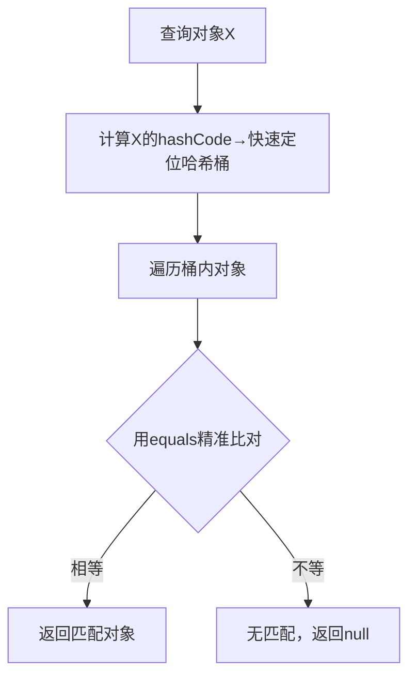

# equals与hashCode的核心关系（精炼版）

## 一、通俗理解

把对象比作“人”：**equals**是“精准身份核验”（逐字段比对，确定是否为同一对象）；**hashCode**是“身份编号”（快速生成数字标识，用于快速定位）。

核心逻辑：相等的对象（equals=true）必须有相同编号（hashCode相等）；编号相同（hashCode相等）的对象不一定相等（哈希碰撞）；编号不同（hashCode不等）的对象必不相等（equals=false）。

## 二、核心规则表

|场景|equals结果|hashCode要求|
|---|---|---|
|A与B是同一对象（A==B）|true|必须相等|
|A.equals(B)=true|true|必须相等|
|A.equals(B)=false|false|可相等（碰撞）/可不等|
|A.hashCode()≠B.hashCode()|false|必然结果|
## 三、核心应用：哈希容器查询逻辑

解读：hashCode负责“快速找范围”，equals负责“精准确认”，协同提升查询效率。

## 四、关键提醒与总结

重写equals时必须重写hashCode！否则会破坏规则，导致HashMap/HashSet等哈希容器识别异常（如把相等对象当成不同key）。

总结：1. equals是“最终判断标准”，确认对象是否真相等；2. hashCode是“快捷索引”，减少equals调用以提升效率；3. 核心约束：相等对象必同hashCode，反之未必。
> （注：文档部分内容可能由 AI 生成）