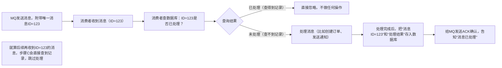

# 如何保证消息不重复消费（消息消费幂等性）：通俗讲解

先搞懂两个核心概念，用大白话讲透：

- **消息重复消费**：同一消息被消费者收到并处理了多次。就像你买了一件快递，快递员反复给你送了3次，你要是每次都付款，就亏大了；

- **幂等性**：不管收到多少次相同的消息，处理结果都一样，不会造成重复影响。就像快递签收——就算快递员多送几次，你只签一次字、只收一件货，不会多收到商品。

核心目标：让消费者处理消息时，具备“多处理一次也没事”的能力，避免重复消费导致的问题（比如重复扣款、重复发货、数据错乱）。

## 一、先搞懂：为什么消息会重复消费？（3个常见原因）

不是MQ故意发重复消息，而是分布式系统中“故障和网络波动”导致的，就像快递重复派送的原因一样：

1. **消费者没及时“确认签收”**
消费者处理完消息后，需要给MQ发“ACK确认”（相当于快递签收），告诉MQ“我已经处理完了，你可以删消息了”。如果消费者处理完消息后，还没发ACK就宕机了（比如服务器断电），MQ会以为消费者没处理完，等消费者重启后，会重新把消息发过去——导致重复处理。

2. **网络波动导致“ACK丢失”**
消费者处理完消息，也发了ACK，但ACK在网络传输中丢了（比如网络断了），MQ没收到确认，还是会重新发消息——消费者就会收到重复消息。

3. **MQ故障恢复后重发**
MQ集群故障后恢复，或者主从切换时，可能会把一些“不确定是否已处理”的消息重新发给消费者，确保消息不丢失，但也可能导致重复。

总结：重复消费是“MQ为了保证消息不丢失”而产生的“副作用”，无法完全避免，只能通过“幂等性设计”来解决。

## 二、保证幂等性的核心思路

不管收到多少次相同消息，处理结果都一样——核心是给消息“做个唯一标识”，让消费者能认出“这个消息我已经处理过了”，然后直接忽略，不重复处理。

就像快递员送快递时，会核对你的快递单号：如果这个单号你已经签收过了，就不会再让你签第二次，直接跳过。

## 三、4种通俗好用的幂等性方案（附生活类比）

|幂等性方案|通俗类比|具体做法（大白话）|适用场景|
|---|---|---|---|
|1. 基于消息唯一ID去重（最常用）|快递单号唯一，签收后记录单号，再收到相同单号直接忽略|① MQ发送消息时，给每个消息分配一个全局唯一的ID（比如UUID、雪花ID）；② 消费者收到消息后，先去数据库查“这个ID有没有被处理过”；③ 如果查得到（已处理），直接忽略；如果查不到（未处理），就处理消息，处理完后把“消息ID”和“处理结果”存到数据库。|几乎所有场景（比如订单创建、消息通知、数据同步）|
|2. 基于业务唯一标识去重|你买东西的订单号唯一，就算收到多次“付款成功”的通知，也只扣一次款|① 不用MQ的消息ID，用业务本身的唯一标识（比如订单号、支付流水号、用户ID+操作类型）；② 消费者处理消息时，先查数据库“这个订单号有没有被处理过”；③ 已处理就忽略，未处理就处理并记录订单号。|有明确业务唯一标识的场景（比如订单支付、物流状态更新）|
|3. 数据库唯一约束（防重复写入）|你去银行办业务，身份证号是唯一的，就算你重复提交申请，银行也只给你办一次|① 在数据库表中，给“业务唯一标识字段”加“唯一约束”（比如订单号字段设为唯一索引）；② 消费者处理消息时，直接往数据库插数据（比如插入订单记录）；③ 如果第一次插成功（未处理），就处理完成；如果第二次插（重复消息），数据库会报“唯一约束冲突”，消费者捕获这个错误，直接忽略，不重复处理。|需要往数据库写入数据的场景（比如创建订单、新增用户记录）|
|4. 状态机判断（防重复操作）|快递状态：已签收→再收到“签收通知”就忽略；未签收→才处理签收动作|① 业务数据有明确的状态流转（比如订单状态：待支付→支付中→已支付→已完成）；② 消费者处理消息前，先查当前业务状态；③ 如果状态已经是“已处理”（比如订单已支付），就忽略；如果是“未处理”（比如待支付），才处理并更新状态。|有状态流转的业务（比如订单支付、物流状态更新、任务调度）|
## 四、实战流程演示（以“基于消息唯一ID去重”为例）

## 五、关键注意事项（避坑指南）

- **去重记录要持久化**：把“已处理的消息ID”存在数据库或Redis里（不能存在内存），不然消费者宕机后，之前的去重记录就丢了，重启后还是会重复处理。

- **唯一ID要全局唯一**：不管是MQ的消息ID，还是业务唯一标识，都要确保“不会重复”，不然会把不同的消息当成重复消息忽略，导致业务错误。

- **处理消息和记录去重要原子性**：比如“处理消息”和“存消息ID到数据库”要在同一个数据库事务里——要么都成功，要么都失败，避免“消息处理完了，但记录没存上”的情况（比如处理完消息后宕机，重启后还是会重复处理）。

- **不要依赖“自动ACK”**：尽量用“手动ACK”，等消息处理完、去重记录存好后，再发ACK——避免没处理完就发ACK，导致消息丢失；也避免处理完没发ACK，导致重复消费时无法识别。

## 六、总结：幂等性的核心就是“认得出、不重复”

保证消息不重复消费，本质就是给消息做“唯一身份证”，让消费者能认出“老熟人”并忽略。最常用、最通用的方案是“基于消息唯一ID去重”，其他方案根据业务场景选择即可。

记住：重复消费无法完全避免，我们不用纠结“怎么不让MQ发重复消息”，而是要在消费者端做好“幂等性设计”——就算收到重复消息，也不会造成业务问题。

> （注：文档部分内容可能由 AI 生成）

# 工作中 MQ 重复发消息：真实且高频出现！

结论先给死：**实际工作中，MQ 重复发消息是大概率会遇到的场景，不是小概率偶发问题，而是分布式系统下的 “常态”** —— 只要用 MQ，就必须做幂等性设计，否则早晚会踩坑。

## 一、工作中哪些场景会实实在在遇到重复消息？

用真实工作场景举例（都是一线开发 / 运维常碰到的情况）：

### 场景 1：消费者 ACK 超时 / 丢失（最常见）

比如你做电商订单系统，消费者（订单处理服务）收到 MQ 的 “下单消息” 后，开始扣库存、生成订单；处理完后正要给 MQ 发 ACK 确认，结果：

- 消费者服务器突然宕机（比如运维误操作重启、服务器断电）；
- 网络突然抖动（比如机房交换机故障），ACK 消息卡在半路没到 MQ；
- 消费者处理耗时过长，超过 MQ 的 “超时重试时间”（比如 MQ 等了 30 秒没收到 ACK，默认消费者处理失败）。

MQ 没收到 ACK，会判定 “这个消息没处理完”，等消费者重启 / 网络恢复后，会重新把这条消息发过去 —— 这是工作中重复消息最主要的来源，几乎每个用 MQ 的系统都会遇到。

### 场景 2：MQ 集群故障恢复（高可用带来的 “副作用”）

比如 SOFAMQ/Kafka 的主 Broker 宕机，触发主从切换：

- 切换过程中，MQ 会把 “不确定是否已处理” 的消息重新分发（比如主 Broker 宕机前刚收到消息，但还没同步给从 Broker，切换后从 Broker 会重新发这条消息）；
- 甚至 MQ 集群升级、扩容后，也可能出现少量消息重发 —— 这是 MQ 为了保证 “消息不丢失” 的必然选择，代价就是少量重复。

### 场景 3：生产者重试导致重复发送

生产者（比如用户下单接口）发消息给 MQ 时，网络卡顿没收到 “发送成功” 的确认，于是按配置自动重试：

- 比如重试了 2 次，其实第一次消息已经成功发到 MQ 了，只是确认回执丢了；
- 最终 MQ 里会有 3 条一模一样的消息，消费者会依次收到这 3 条 —— 这种情况在高并发场景（比如大促）下更易出现。

### 场景 4：人工运维操作（容易被忽略）

比如线上出问题后，运维人员手动重试 MQ 的 “死信队列消息”“积压消息”：

- 操作时没注意，把同一条消息重新投递了多次；
- 或者误操作把已处理的消息重新发回正常队列 —— 这也是工作中真实会发生的人为重复。

## 二、为什么说 “必须重视”？（踩过的坑）

举两个真实的线上故障案例，都是因为没做幂等性导致的：

1. **电商大促重复下单**：某平台 618 大促，MQ 因网络波动重复发 “下单消息”，消费者没做幂等，同一个用户的订单被生成了 3 次，扣了 3 次库存，最后只能人工退款 + 补偿；
2. **支付重复扣款**：某金融系统，支付成功的消息被 MQ 重复发送，消费者没校验订单号，同一个支付流水扣了 2 次用户余额，造成客诉和资金损失。

这些坑不是 “理论问题”，而是真金白银的损失 —— 所以行业内有个共识：**只要用 MQ，消费者端的幂等性设计是 “标配”，不是 “可选”**。

## 三、补充：不是所有重复都要处理？

也有例外 —— 如果你的业务是 “无副作用的操作”（比如日志采集、数据统计），重复消费 1 次影响不大（统计结果差一点可以接受），这种场景可以不用做幂等；但只要涉及 “写数据、扣库存、扣款、发通知、创建订单” 等有业务副作用的操作，必须做幂等。

## 总结

工作中 MQ 重复发消息是**真实、高频、无法完全避免**的 —— MQ 的设计目标是 “保证消息不丢失”，而 “不重复” 是靠消费者端的幂等性来兜底的。与其纠结 “怎么让 MQ 不发重复消息”，不如在做系统设计时，默认 “消息一定会重复”，提前做好幂等性，这是一线开发的必备习惯。