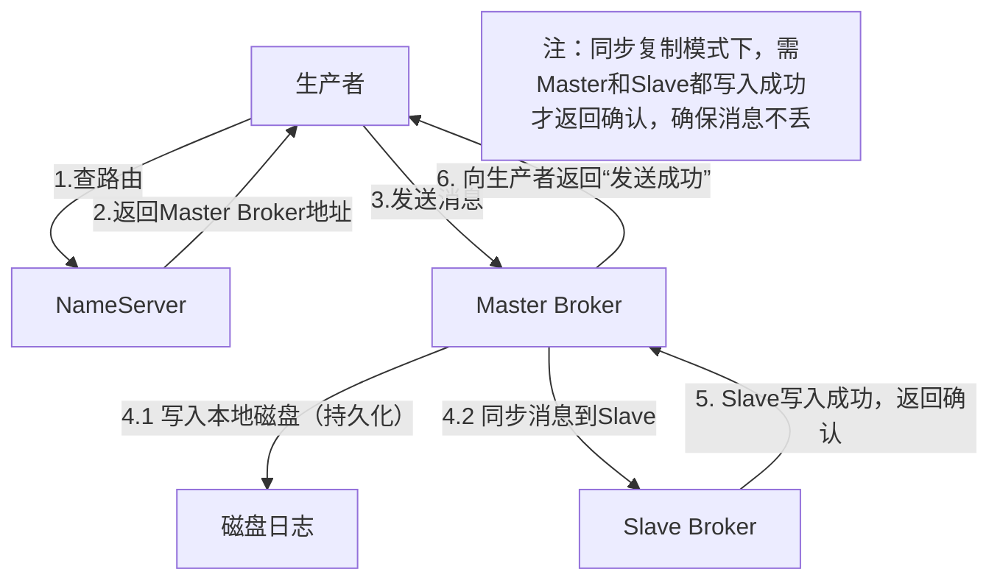

# SOFAMQ高可用机制：通俗讲解+表格+图文

## 一、先搞懂：SOFAMQ的高可用到底是什么？

通俗说，SOFAMQ的高可用就是**“消息不丢、服务不断”**——哪怕某台服务器宕机、网络出问题，生产者仍能正常发消息，消费者也能持续收消息，已存入的消息不会凭空消失。

用“快递中转站”类比理解核心组件：

- **NameServer（地址簿+调度中心）**：相当于快递行业的全国调度中心，记录每个中转站（Broker）的位置和负责的快递片区（Topic），还能帮中转站选“负责人”（主节点）。

- **Broker（核心中转站）**：真正存消息、转发消息的节点，分“主站（Master）”和“分站（Slave）”——主站负责收快递（接消息）和派快递（发消息），分站实时复制主站的快递，防止主站出问题。

- **生产者/消费者（寄件人/收件人）**：寄件人先问调度中心（NameServer）该把快递送哪个中转站，收件人也从调度中心查该去哪个中转站取件。

高可用的核心逻辑：**不让任何一个组件“孤军奋战”**，通过多节点集群、数据备份、故障自动切换，确保整个“快递网络”不瘫痪。

## 二、SOFAMQ保证高可用的核心方案（表格总结）

|核心方案|通俗解释|核心作用|关键细节|
|---|---|---|---|
|NameServer集群部署|调度中心不止一个，全国多城市都有备份|避免调度中心单点故障，确保寄件人/收件人总能查到中转站信息|无状态节点，可横向扩展；内置Zookeeper负责Broker选主|
|Broker主从复制|每个中转站（Broker）都设主站和分站，分站实时抄录主站的快递信息|主站宕机后，分站能直接接手工作，消息不丢失|1个Master可对应多个Slave；支持同步/异步复制（同步复制更可靠，异步复制吞吐量更高）|
|基于Raft的自动选主|中转站主站宕机后，调度中心+分站自动投票选新主站，不用人工干预|减少故障恢复时间，业务无感知|通过SOFAJRaft实现，同一时刻只有1个主站；选主后自动同步未完成的消息|
|消息持久化|快递不仅记在电脑临时内存，还打印成纸质单存档（写入磁盘）|防止服务器断电、进程崩溃导致消息丢失|消息写入磁盘日志文件，支持快照备份，重启后可恢复|
|同城/异地灾备|在不同机房甚至不同城市设备份中转站，主机房出问题自动切换到备份机房|应对机房级故障（如停电、火灾），保障全局服务可用|支持本地优先策略，优先从本地机房收发消息，提升性能|
## 三、图文可视化：一看就懂的高可用架构与流程

### 1. SOFAMQ高可用核心架构图

图片来源：https://help.aliyun.com/document_detail/146959.html

`NameServer` 的中文翻译是：**名称服务器** ，负责**管理名称与对应实体映射关系**的服务器。NameServer（调度中心）

 SOFAMQ 里，NameServer（名称服务器）的核心作用是存储 Broker 节点的地址信息、Topic 与 Broker 的映射关系，相当于消息队列集群的 “地址簿”。

Broker 节点： 消息队列的 “快递中转站”。中文专业名称：消息代理节点 ；本质：  运行在服务器上的 MQ 核心进程

用快递业务类比，Broker 节点就是负责接收、存储、转发消息的核心中转站，是消息队列的 “主力军”。

Broker 节点是消息存储和转发的核心，会部署成 主从集群（Master + Slave）来保证高可用。

Master 节点负责处理读写请求，Slave 节点实时同步 Master 的数据，Master 宕机后，Slave 会被选举为新的 Master，确保消息不丢、服务不断。

NameServer（名称服务器）会管理所有 Broker 节点的信息，生产者 / 消费者需要先从 NameServer 查到 Broker 地址，才能和 Broker 通信。

架构解读：

1. 所有核心组件都做了集群化，没有单点；
2. Broker主从之间实时同步消息，确保数据多副本；
3. 生产者消费者与多个NameServer连接，就算某个NameServer宕机，仍能正常通信。

### 2. 故障自动切换流程（主Broker宕机场景）

### 3. 消息可靠发送流程（确保消息不丢的关键）

## 四、总结：SOFAMQ高可用的核心逻辑

SOFAMQ的高可用不是靠单一技术，而是“**集群化部署+多副本备份+自动故障转移+消息持久化**”的组合拳：

- 用NameServer集群解决“调度中心单点”问题；

- 用Broker主从复制+Raft选主解决“核心节点故障”问题；

- 用消息持久化+同城/异地灾备解决“数据丢失”问题；

- 最终实现“无论局部出什么问题，整个消息系统都能正常运转”的高可用目标。
> （注：文档部分内容可能由 AI 生成）