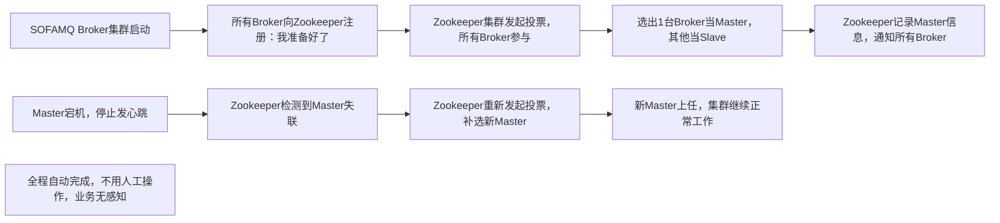

# Zookeeper通俗讲解：分布式系统的“大管家”

先给结论：Zookeeper 不是数据库，也不是业务服务器，而是专门帮“多台服务器组成的集群”（比如之前聊的SOFAMQ、Kafka集群）**统一步调、共享信息、解决混乱**的“协调工具”，核心作用就是让分散的服务器们“心往一处想、劲往一处使”，不用各自为战。

用一个生活场景彻底懂：把分布式集群想象成“一家餐厅的后厨”——有多台“灶台”（业务服务器）、多个“厨师”（进程），要高效出餐（完成业务），必须有个“后厨总管”，否则会出现“多个人抢一口锅”“不知道哪道菜该做了”“有人离职没人补位”的混乱。Zookeeper 就是这个“后厨总管”。

## 一、先搞懂：为啥需要Zookeeper？（分布式集群的痛点）

如果没有Zookeeper，多台服务器一起干活会乱成一锅粥，核心有3个痛点：

1. **不知道同伴状态**：A服务器宕机了，B、C服务器还一个劲往A发请求，导致业务卡壳（比如SOFAMQ的Broker主节点挂了，其他节点不知道，还往它那发消息）；

2. **选不出“老大”**：集群需要1个核心节点统筹工作（比如Broker的Master节点），但多台服务器各说各的，选不出统一的“老大”，或者“老大”挂了没人接替；

3. **关键信息不共享**：集群的配置（比如服务器地址、端口）、业务状态（谁在工作、谁空闲），每台服务器自己存一份，改的时候要逐台改，容易出现信息不一致（比如改了Topic配置，有的Broker没同步，导致消息发错地方）。

Zookeeper的出现，就是专门解决这3个问题的。

## 二、Zookeeper核心功能：“大管家”具体做什么？

结合“后厨总管”的类比，Zookeeper的核心功能就4件事，表格一眼看清：

|核心功能|后厨总管类比|分布式集群实际作用|常见应用场景|
|---|---|---|---|
|集群选主|选后厨领班，负责统筹订单；领班离职了，立刻从厨师里补选一个|帮集群选“核心节点”（比如Broker的Master、Kafka的控制器），核心节点宕机后自动补选，不用人工干预|SOFAMQ Broker主从切换、Elasticsearch集群选主|
|状态监控（心跳检测）|实时看每个厨师是否在岗，不在岗就及时安排其他人接手他的订单|监控集群中每台服务器的状态，服务器定期向Zookeeper发“心跳”（告知“我还活着”）；没收到心跳就标记为“宕机”，并通知其他服务器|检测SOFAMQ的NameServer、Broker是否存活|
|共享配置/元数据|后厨公告栏，贴出今日菜单、食材位置、出餐规则，所有厨师统一查看|存储集群的关键小体量信息（非业务数据），所有服务器统一读取；信息更新后，自动同步给所有服务器|存SOFAMQ的Broker地址、Topic对应关系；存Kafka的Topic分区信息|
|分布式锁|只有一把关键厨具（比如烤箱），厨师要先用就得先跟总管登记，用完再归还，避免多人抢用|多台服务器抢同一资源（比如操作同一数据库表、同步同一批数据）时，用Zookeeper“抢锁”，拿到锁才能操作，避免数据混乱|多Broker同步数据时防冲突、分布式任务调度|
## 三、Zookeeper怎么工作？（极简流程，不用懂技术细节）

首先要明确：Zookeeper自己也不会“孤军奋战”，它会集群部署（通常3台、5台节点，奇数台，方便投票决策），避免自己宕机后没人接替。集群里分两种角色：

- **Leader（主节点）**：“大管家头头”，负责决策（比如选主、处理修改配置的请求）；

- **Follower（从节点）**：“帮工”，负责接收服务器的查询请求（比如查配置、查状态）、同步Leader的数据，Leader宕机后参与新Leader选举。

### 举个关键场景：SOFAMQ的Broker选主流程

解读：整个选主过程，Zookeeper是“主导者”，不用人工干预，就能确保集群总有“老大”统筹工作——这也是之前聊SOFAMQ高可用时，Zookeeper的核心作用。

## 四、总结：Zookeeper关键记3点

1. **定位**：分布式系统的“协调工具”，不是数据库（只存小体量关键信息，不存大量业务数据）；

2. **核心价值**：帮多台服务器“统一决策、监控状态、共享信息、抢资源”，解决分布式集群的混乱问题；

3. **常见用法**：几乎所有分布式中间件（SOFAMQ、Kafka、Elasticsearch、Hadoop）都依赖它，是分布式系统的“基础设施”。

简单说：只要是多台服务器一起干活，需要“商量事、统一步调”，找Zookeeper这个“大管家”就对了。
> （注：文档部分内容可能由 AI 生成）